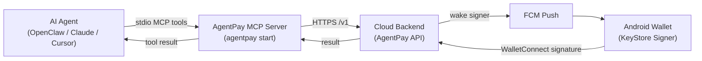

# AgentPay MCP Server: Headless Signing for AI Agents

The **AgentPay MCP Server** is the [Model Context Protocol](https://modelcontextprotocol.io) (MCP) interface for the AgentPay ecosystem. It lets AI agents running in OpenClaw, Claude Desktop, Cursor, and other MCP hosts **request paid actions** that are approved and signed on the user’s **Android phone**—without exposing private keys to the LLM or this CLI.

---

## The problem: custody vs. autonomy

Autonomous agents need to pay for APIs, on-chain services, and x402 endpoints. Letting an agent hold a private key breaks custody. Blocking all spending breaks autonomy.

**AgentPay** splits the roles:

| Role | Where it lives | Responsibility |
|------|----------------|----------------|
| **Agent / LLM** | Your machine (MCP host) | Decides *what* to buy and calls MCP tools |
| **MCP server** (`agentpay`) | Local CLI, stdio | Routes requests to your backend—**no keys** |
| **Cloud backend** | Your deployed API | WalletConnect session, FCM wake-ups, audit logs |
| **Android wallet** | Hardware-backed signer | Policy, approval, **KeyStore signing** |

The MCP server is a **control-plane proxy**, not a wallet. Keys never leave the Android device.

---

## Architecture



ASCII equivalent:

```
[ AI Agent ] --stdio MCP--> [ agentpay CLI ] --HTTPS--> [ Cloud Backend ]
                                                          |
                                                          v
                                                    [ FCM Push ]
                                                          |
                                                          v
                                              [ Android Wallet (Signer) ]
```

---

## Security

- **This MCP server does not hold private keys.** It cannot sign transactions on its own.
- **Signing happens on the user’s phone** (Android KeyStore / hardware-backed storage when available).
- **Spending policies** are enforced in the **Android app**; the backend records activity and coordinates WalletConnect.
- Config on disk (`~/.agentpay/config.json`) stores only **backend URL**, **agent id**, and an optional **API key**—never a seed phrase or private key.

Treat your backend URL and API key like any other service credential.

---

## Installation

### Option A — Skills (recommended)

```bash
npx skills add horizontalsystems/agentpay-mcp --skill agentpay --yes --global
```

Then configure and pair once (see [Commands & setup](#commands--setup)).

### Option B — From source (monorepo)

```bash
git clone https://github.com/horizontalsystems/agentpay-mcp.git
cd agentpay-mcp
npm install
npm run build
npm link   # optional: global `agentpay` on PATH
```

### Option C — npm (when published)

```bash
npm install -g agentpay-mcp
```

---

## Commands & setup

### 1. `agentpay setup`

Interactive configuration. Writes **`~/.agentpay/config.json`**:

| Field | Description |
|-------|-------------|
| `backendUrl` | Your AgentPay API base (e.g. `http://206.189.229.113:3000` — no `/v1` suffix) |
| `agentId` | Agent identity (e.g. `agent_123`) |
| `apiKey` | Optional bearer token if your backend requires it |

**Runtime resolution** (for `connect` / `start`): `AGENTPAY_BACKEND_URL` or `AGENTPAY_API_BASE_URL` in the environment overrides `backendUrl` in the config file. If the file has no `backendUrl`, the CLI uses the hosted MVP default (`http://206.189.229.113:3000`). Only **`agentId`** is required in `~/.agentpay/config.json` for the MCP server to start.

```bash
agentpay setup
```

Running `agentpay` with no subcommand also opens setup.

### 2. `agentpay init` (non-interactive)

Writes `~/.agentpay/config.json` from flags or env (for Docker / OpenClaw):

```bash
export AGENTPAY_BACKEND_URL=http://localhost:3000
export AGENTPAY_AGENT_ID=agent_123
agentpay init
```

### 3. `agentpay connect`

Fetches a **WalletConnect pairing URI** from your backend and prints:

- A raw **`wc:` pairing URI** (open in Unstoppable Wallet — do not wrap in `link.reown.com`)
- A **terminal QR code** (human terminal only)

```bash
agentpay connect              # human: wc: URI + QR
agentpay connect --url-only   # agents: one wc: URI line, then exit (no wait)
```

Requires the backend to be running and `WC_PROJECT_ID` configured server-side. The CLI **does not block** until the phone approves — agents must send the link and continue.

### 4. `agentpay start`

Starts the **MCP server on stdio**. This is what your LLM host invokes—do not run it in a normal terminal session for manual use.

```bash
agentpay start
```

---

## Claude Desktop (manual MCP config)

Add to your Claude Desktop config (path varies by OS), after `agentpay setup` and `agentpay connect`:

```json
{
  "mcpServers": {
    "agentpay": {
      "command": "agentpay",
      "args": ["start"]
    }
  }
}
```

If `agentpay` is not on your `PATH`, use the absolute path to the bundled binary:

```json
{
  "mcpServers": {
    "agentpay": {
      "command": "node",
      "args": ["/absolute/path/to/agentpay-mcp/build/index.js", "start"]
    }
  }
}
```

Restart Claude Desktop after editing the config.

---

## OpenClaw / Docker (persistent setup)

Container restarts wipe **global npm** and non-mounted paths. Use **volumes** and the install script.

| Path | Purpose |
|------|---------|
| `/home/node/.openclaw/workspace` | Agent workspace (persistent) |
| `/home/node/.openclaw/agentpay-mcp/` | Built MCP CLI |
| `/home/node/.agentpay/config.json` | `backendUrl`, `agentId` |
| `/home/node/.openclaw/mcporter/mcporter.json` | mcporter MCP server registry |
| `/home/node/.openclaw/tools/mcporter/` | mcporter npm prefix (not global) |

**First run** (from this package after clone):

```bash
export AGENTPAY_BACKEND_URL=http://your-backend:3000
export AGENTPAY_AGENT_ID=agent_123
npm run install:openclaw
source /home/node/.openclaw/agentpay-mcp/openclaw.env
```

**Env vars** (set in OpenClaw agent shell):

```bash
export MCPORTER_CONFIG=/home/node/.openclaw/mcporter/mcporter.json
export AGENTPAY_CONFIG_DIR=/home/node/.openclaw/agentpay
export PATH="/home/node/.openclaw/tools/mcporter/node_modules/.bin:$PATH"
```

**mcporter** must use the persistent config (Docker has no stable cwd):

```bash
mcporter --config "$MCPORTER_CONFIG" call agentpay.get_spending_status
```

**Skill:** install from `/home/node/.openclaw/agentpay-mcp/SKILL.md` (not `/app`). See `SKILL.md` for agent commands (`connect --url-only`, mcporter calls).

Copy `openclaw.env.example` into your image or profile if you prefer manual env setup.

---

## Tools for the LLM

The server name exposed over MCP is **`agentpay-firewall`**.

### Backend catalog vs client registry

- **Client registry** (`list_x402_services`, `sdk/x402/builtin.ts`, `config/x402-services.json`): where you add Exa, twit.sh, Bazaar APIs — **no backend deploy**.
- **Backend catalog** (`x402_custom` only): one signing slot. All paid calls use `serviceId: x402_custom` with `payload.registryId` (e.g. `twit_user_by_username`, `twit_list_by_id`) and `payload.resource.url` for audit logs.

### `list_x402_services`

Lists registered x402 services (built-in + `config/x402-services.json`). Returns `serviceId`, `url`, `method`, `argsHint`.

### `fetch_paid_service` (preferred for all x402 APIs)

Runs the **full x402 flow**: provider HTTP 402 → WalletConnect EIP-712 sign → paid retry → real API JSON.

| Input | Type | Description |
|-------|------|-------------|
| `serviceId` | string (optional) | Registered service from `list_x402_services` |
| `args` | object (optional) | Request args per service `argsHint` |
| `url` | string (optional) | Ad-hoc x402 endpoint (use instead of `serviceId`) |
| `method` | GET \| POST \| … | Required with `url` |
| `headers` / `body` | object | Optional ad-hoc overrides |

**Use for:** any x402-paid HTTP API. Extend via `config/x402-services.json` or `AGENTPAY_X402_SERVICES_PATH`.  
**Do not use** `pay_and_call_service` for x402 catalog services.

### `pay_and_call_service` (advanced)

Low-level signing with a custom payload. For catalog x402 services, use `fetch_paid_service` instead.

| Input | Type | Description |
|-------|------|-------------|
| `serviceId` | string | Backend catalog id |
| `amountUsd` | number | Intended payment amount in USD |
| `description` | string | Short human-readable reason |

For manual x402, the payload must include `action: "x402_pay_generic"` plus `recipient`, `amount`, and `asset` from the provider 402 response.

### `get_spending_status`

Read **wallet balance** (mock ledger on backend) and **recent activity** from `GET /v1/status`.

| Input | Type | Description |
|-------|------|-------------|
| _(none)_ | — | Uses configured `agentId` |

**Use when:** checking spend today, balance, or recent approvals/blocks before a large payment.  
**Note:** Daily limits are enforced on **Android**; this tool reflects backend logs, not the full policy engine.

---

## Development

```bash
npm run build          # esbuild → build/index.js (single bundle + shebang)
npm run setup          # node build/index.js setup
npm run start          # node build/index.js start
```

Requires **Node.js ≥ 18** and a running **AgentPay backend** with PostgreSQL migrated.

---

## Related projects

| Component | Role |
|-----------|------|
| **AgentPay backend** | Express API, WalletConnect, FCM, Prisma/Postgres |
| **Android app** | Policy, approvals, KeyStore signing |
| **@agentpay/sdk** | HTTP client used inside this bundle |

---

## License

MIT
